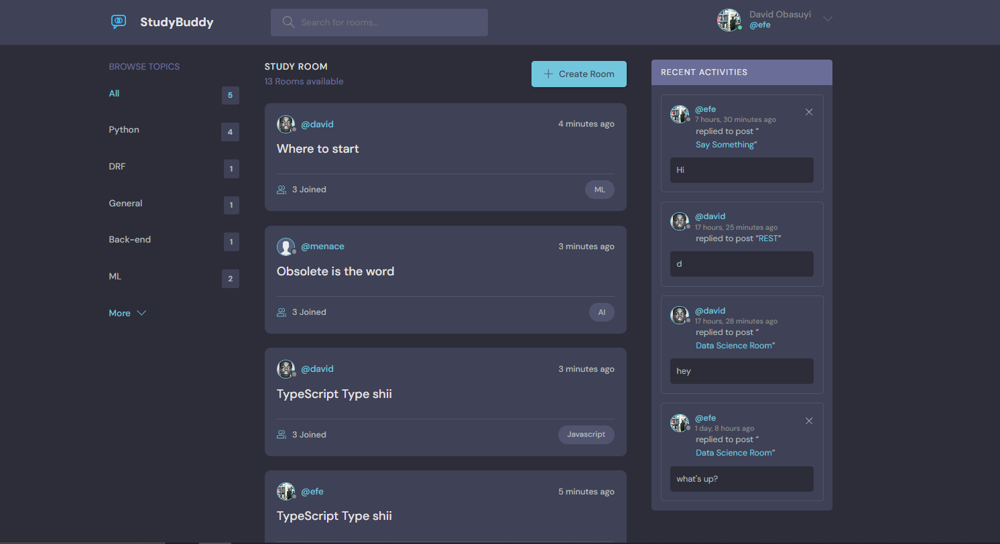
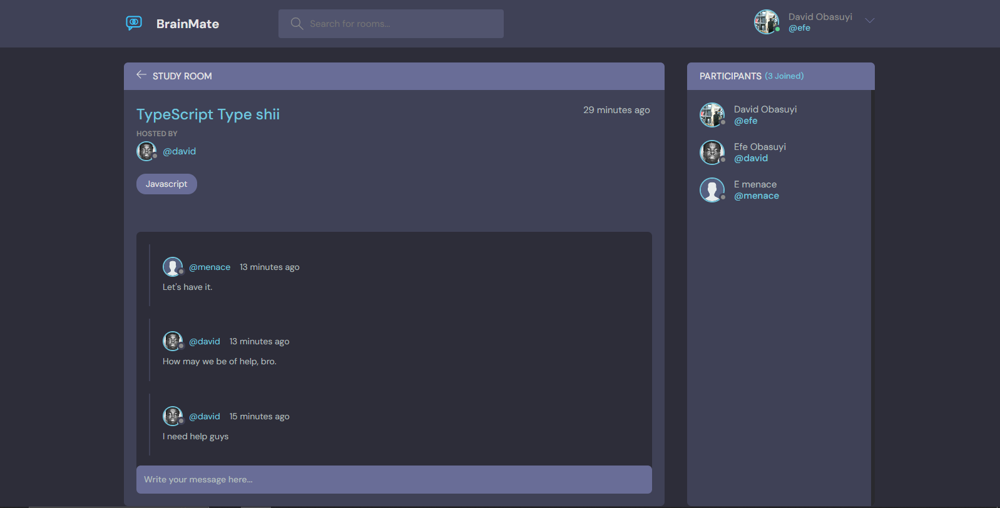
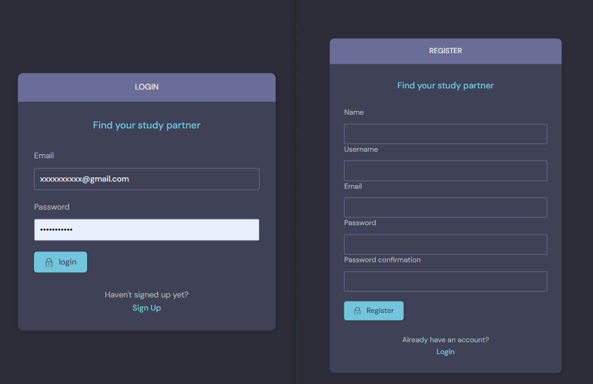

# BrainMate

BrainMate is a community-driven web app where users can create and join topic-based rooms to chat, collaborate, and share knowledge.  
It is built with Django and designed to be lightweight, simple, and extendable.

> **Live Demo:** *(localhost8000.com)* Just kidding, Free Tier deploymennt expired.

---

## ✨ Features

- 🔑 User authentication (register, login, logout)  
- 🏷 Topic-based rooms
- ➕ Create, update, and delete rooms  
- 🎨 Clean UI built with Django templates and CSS  
- 🔮 Backend structured for future REST API & real-time chat  (coming Real Soon)

---

## 📸 Screenshots


  
*Home page showing available rooms and topics*

  
*Inside a topic-based room*

  
*User login & signup page*

---

## 🛠 Technologies Used

- **Backend:** Django (Python)  
- **Frontend:** HTML, CSS (Django templates)  
- **Database:** SQLite (default, switchable to PostgreSQL/MySQL)  
- **Dev Tools:** venv, Django management commands, Git/GitHub  

---

## 📂 Project Structure

```text
brainMate/
├── base/               # Core models (Topic, Room, etc.)
├── users/              # User authentication & profiles
├── brainMate/          # Project settings
├── templates/          # HTML templates
├── static/             # CSS, images, favicon
├── manage.py           # Django utility script
├── requirements.txt    # Python dependencies
└── README.md           # Project documentation
```

## 🚀 Installation & Setup

### Clone the repo
```
git clone https://github.com/Efe-The-Menace/BRAIN-MATE.git
cd BRAIN-MATE
```
### Create and activate virtual environment
```
python -m venv env
# macOS/Linux
source env/bin/activate
# Windows
env\Scripts\activate
```
### Install dependencies
```
bash
pip install -r requirements.txt
```
### Apply database migrations
```
python manage.py migrate
```
### Start development server
```
python manage.py runserver
```
### Visit locally
Open http://127.0.0.1:8000/
 on your machine after setting up your database
(pending when ours goes back live)


### 💡 Usage Tips

Dummy users (alice, bob, charlie, david) with password password123 can be used for testing.
Browse topics, join rooms, and start conversations.
Extendable for future features like real-time messaging, search, and profiles.

### 🛣 Roadmap

🔴 Real-time chat with Django Channels/WebSockets
🔒 Private/public rooms
🖼 User profiles with avatars & bios
📱 REST API for external apps or mobile clients
🔍 Search and filtering inside rooms

🤝 Contributions

Contributions are welcome!
Open an issue or submit a pull request.
